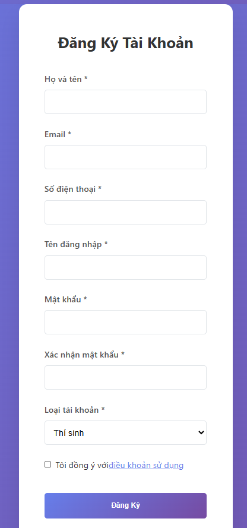

<h2 align="center">
    <a href="https://dainam.edu.vn/vi/khoa-cong-nghe-thong-tin">
    🎓 Faculty of Information Technology (DaiNam University)
    </a>
</h2>
<h2 align="center">
    University Admission Management
</h2>
<div align="center">
    <p align="center">
        
        
        
    </p>

[](https://www.facebook.com/DNUAIoTLab)
[](https://dainam.edu.vn/vi/khoa-cong-nghe-thong-tin)
[](https://dainam.edu.vn)
</div>


## 📖 1. Giới thiệu:
#Hệ thống Quản lý Tuyển sinh Hệ Đại học được xây dựng nhằm hỗ trợ toàn bộ quy trình tiếp nhận, xử lý hồ sơ, và quản lý kết quả xét tuyển của thí sinh.
Thay vì dựa vào các phương pháp thủ công, các biểu mẫu giấy tờ phức tạp, hay hệ thống dữ liệu phân tán dễ xảy ra sai sót, ứng dụng web này mang đến một giải pháp số hóa, tập trung, hiệu quả và minh bạch. 🚀 Nó giúp tự động hóa nhiều tác vụ lặp đi lặp lại, từ đó giảm thiểu đáng kể khối lượng công việc cho đội ngũ cán bộ tuyển sinh, đồng thời cung cấp trải nghiệm đăng ký thuận tiện cho thí sinh.

## 🔧 2. Các công nghệ được sử dụng
<div align="center">

### Hệ điều hành

[](https://www.microsoft.com/en-us/windows/)
[](https://ubuntu.com/)

### Công nghệ chính
[](https://www.php.net/)
[](#)
[](#)
[](#)
[](#)
[](https://getbootstrap.com/)

### Web Server & Database
[](https://httpd.apache.org/)
[](https://www.mysql.com/) 
[](https://www.apachefriends.org/)

### Database Management Tools
[](https://dev.mysql.com/downloads/workbench/)
</div>

## 🚀 3. Hình ảnh các chức năng
### Trang đăng nhập


### Trang đăng kí



### Trang chủ


## ⚙️ 4. Cài đặt

### 4.1. Cài đặt công cụ, môi trường và các thư viện cần thiết

- Tải và cài đặt **XAMPP**  
  👉 https://www.apachefriends.org/download.html  
  (Khuyến nghị bản XAMPP với PHP 8.x)

- Cài đặt **Visual Studio Code** và các extension:
  - PHP Intelephense  
  - MySQL  
  - Prettier – Code Formatter  
### 4.2. Tải project
Clone project về thư mục `htdocs` của XAMPP (ví dụ ổ C):

```bash
cd F:\xampp\htdocs
https://github.com/VuVietLong1207/Quan_li_tuyen_sinh_he_dai_hoc.git
Truy cập project qua đường dẫn:
👉 http://localhost/admission_management/
```


### 4.3. Setup database
Mở XAMPP Control Panel, Start Apache và MySQL


### 4.4. Setup tham số kết nối
Mở file config.php (hoặc .env) trong project, chỉnh thông tin DB:


### 4.5. Chạy hệ thống
Mở XAMPP Control Panel → Start Apache và MySQL

Truy cập hệ thống:
👉 http://localhost/index.php


### 4.6. Đăng nhập lần đầu
